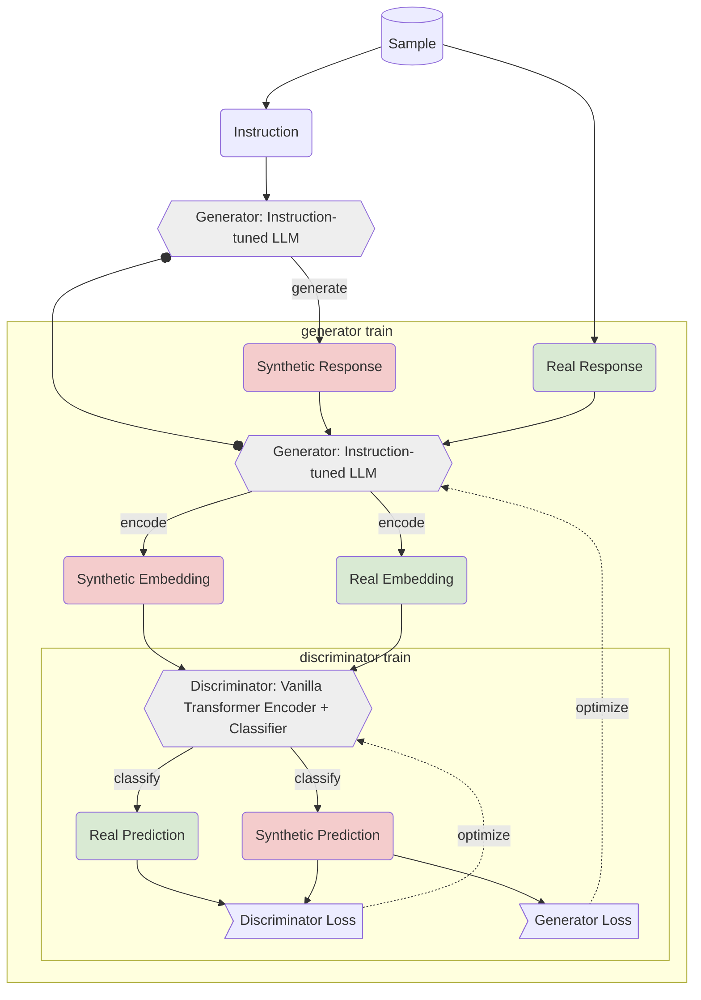

# LLM Reinforcement with GANs: Aligning LLMs through Discriminator Reward Functions

General training structure similar to RLGAF [^1].
Discriminator archicture inspired by TransLSTM [^2].
Loss/Objective equal to orginal GAN proposal.

## Experimental Design

## Roadmap

1. Preparing an instruction-tunable dataset based on TWON dataset
2. 

[^1]: Fine-tuning Language Models with Generative Adversarial Reward Modelling: <https://arxiv.org/abs/2305.06176>
[^2]: TransLSTM: A hybrid LSTM-Transformer model for fine-grained suggestion mining <https://www.sciencedirect.com/science/article/pii/S2949719124000372  >