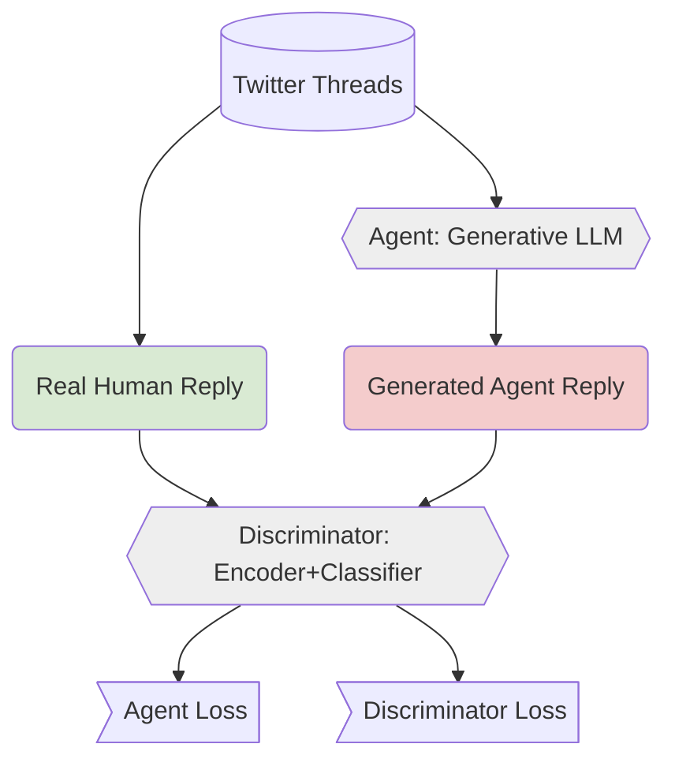

# LLM Reinforcement with GANs: Aligning LLMs through Discriminator Reward Functions

General training structure similar to RLGAF [^1].

## Experimental Design

## Roadmap

1. Preparing an instruction-tunable dataset based on TWON dataset
2. 

[^1]: Fine-tuning Language Models with Generative Adversarial Reward Modelling: <https://arxiv.org/abs/2305.06176>